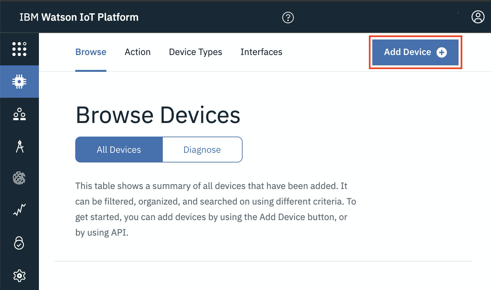

# Pyrrha sensor simulator

This repository will contain the [Pyrrha](https://github.com/Pyrrha-Platform/Pyrrha) solution sensor simulator.

[](https://www.apache.org/licenses/LICENSE-2.0) [](https://callforcode.org/slack)

## Setting up the solution

### Code overview

This simple OpenWhisk function creates a MQTT client for the Pyrrha solution. The client sends the following message as an IoT device to the IoT platform every minute:

```
{
    "firefighter_id": params.IOT_FIREFIGHTER_ID,
    "device_id": params.IOT_DEVICE_ID,
    "device_battery_level": (Math.random() * (0.00 - 100.00) + 0.0200).toFixed(2),
    "temperature": (Math.random() * 50).toFixed(2),
    "humidity": (Math.random() * 100).toFixed(2),
    "carbon_monoxide": (Math.random() * 150).toFixed(2),
    "nitrogen_dioxide": (Math.random() * 10).toFixed(2),
    "formaldehyde": (Math.random() * 10).toFixed(2),
    "acrolein": (Math.random() * 10).toFixed(2),
    "benzene": (Math.random() * 10).toFixed(2),
    "device_timestamp": getUTCTime()
}
```

### Add device to the IoT platform

This solution was built for the [IBM IoT platform](https://cloud.ibm.com/catalog/services/internet-of-things-platform), but will publish events to any MQTT server. If using the IBM IoT platform, add a new device to the platform first.



Use `PyrrhaDevice` as the device type.


### Edit configuration

The following parameters need to be set as local environment variables or as Github Actions environment secrets for the code to work. You can fill out `.example.sh` and run `source ./.example.sh` to create the environment variables locally.

```
IOT_HOST=""
IOT_PROTOCOL=""
IOT_USERNAME=""
IOT_PASSWORD=""
IOT_SECURE_PORT=""
IOT_PORT=""
IOT_CLIENTID=""
IOT_PEM=""
IOT_FIREFIGHTER_ID=""
IOT_DEVICE_ID=""
```

The `IOT_CLIENTID` needs to be of the format `d:orgId:deviceType:deviceId`. The `deviceID` should be the same as the `Device ID` shown in the image above. You can get the rest of the configuration from the IoT platform.

## Deployment

### Run locally

The action is a simple node.js application. Execute the following steps to run it locally:

1. install the dependencies
   ```
   npm install
   ```
2. run the code
   ```
   npm start
   ```

### Run on IBM Cloud

1. install the dependencies
   ```
   npm install
   ```
2. deploy the code
   ```
   ibmcloud fn deploy
   ```

## Contributing

Please read [CONTRIBUTING.md](CONTRIBUTING.md) for details on our code of conduct, and the process for submitting Pyrrha pull requests.

## License

This project is licensed under the Apache 2 License - see the [LICENSE](LICENSE) file for details.
